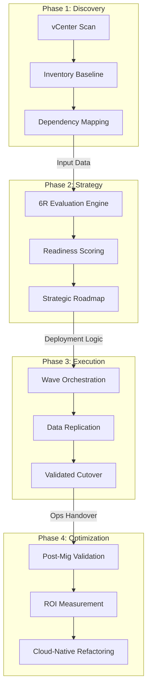
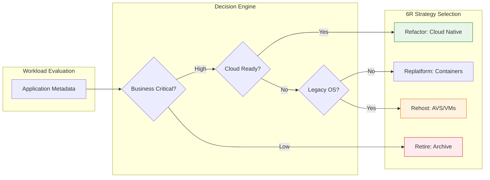

<div align="center">


<h1>VMware to Cloud Playbook</h1>

<p><strong>The Strategic Framework for Enterprise VMware-to-Cloud Migration, 6R Transformation Planning, and Automated Landing Zone Orchestration.</strong></p>

[]()
[]()
[]()

<br/>

> **"Migration is not just a destination; it's a strategic modernization."** 
> The **VMware to Cloud Playbook** is an institutional-grade platform designed to provide a secure, measurable, and highly automated foundation for global VMware transformations. It orchestrates the entire lifecycle—from synthetic discovery and 6R recommendation to real-time wave execution and unified ROI modeling.

</div>

---

## 🏛️ Executive Summary

Legacy VMware environments are becoming strategic operational liabilities. Organizations often fail in their cloud journey not due to a lack of tools, but because of fragmented discovery standards, lack of clear 6R strategy alignment, and an inability to model Total Cost of Ownership (TCO) with precision.

This platform implements the **Migration Intelligence Plane**. It operationalizes migration as a first-class architectural pillar, providing a centralized command center where migration strategy is treated as code. By automating the assessment and execution phases, we eliminate migration risks and ensure that every workload lands in a cost-optimal, secure environment.

---

## 📐 Principal Architecture: Enterprise Migration Factory

This reference architecture illustrates the end-to-end flow from on-premises discovery to multi-cloud landing zones, managed by a centralized intelligence plane.

```mermaid
graph LR
    %% Subgraph Definitions
    subgraph Identity["Identity & Access (Zero Trust)"]
        direction TB
        IDP[Microsoft Entra ID / AWS IAM]
        RBAC[Fine-grained RBAC Control]
        MSI[Managed Service Identities]
    end

    subgraph OnPrem["On-Premises VMware Environment"]
        direction TB
        vCenter[vCenter Server]
        Workloads[vSphere VMs / Apps]
        HCX[VMware HCX Manager]
        Discovery[Discovery Agent / Scan]
    end

    subgraph Connectivity["Secure Networking & Edge"]
        direction TB
        EXR[ExpressRoute / Direct Connect]
        HubVNet[Hub VNet / Shared Services]
        FW[Azure Firewall / AWS WAF]
        PE[Private Endpoints]
    end

    subgraph IntelligencePlane["Migration Intelligence Plane (Hub)"]
        direction TB
        API[FastAPI Migration Gateway]
        Engine[6R Strategy & ROI Engine]
        DB[(Postgres: Migration State)]
        Cache[(Redis: Real-time Sync)]
        UI[React Command Center]
    end

    subgraph TargetPlatform["Cloud Target Landing Zone"]
        direction TB
        AVS[Azure VMware Solution / VMC]
        IaaS[Native IaaS (VMs)]
        PaaS[AKS / App Service]
        DataLayer[(Azure SQL / RDS)]
    end

    subgraph DevOps["DevOps & Infrastructure as Code"]
        direction TB
        GH[GitHub Actions Pipelines]
        TF[Terraform / Bicep Modules]
        Registry[Private Module Registry]
    end

    subgraph Observability["Observability & Governance"]
        direction TB
        Monitor[Azure Monitor / CloudWatch]
        Dash[Grafana Migration Velocity]
        Policy[Azure Policy / AWS Config]
    end

    %% Flow Arrows
    Users((Enterprise Users)) -->|HTTPS/TLS| UI
    UI -->|JSON API| API
    API -->|Identity Token| IDP
    
    Discovery -->|1. Synthetic Scan| vCenter
    vCenter -->|2. Metadata Export| API
    
    API -->|3. Evaluate| Engine
    Engine -->|4. Store State| DB
    
    GH -->|5. Trigger IaC| TF
    TF -->|6. Provision| TargetPlatform
    
    HCX -->|7. Data Transfer| EXR
    EXR -->|8. Secure Tunnel| HubVNet
    HubVNet -->|9. Inspect| FW
    FW -->|10. Land| TargetPlatform
    
    TargetPlatform -->|Telemetery| Monitor
    Monitor -->|Visualize| Dash
    Policy -->|Enforce| TargetPlatform

    %% Styling
    classDef identity fill:#e1f5fe,stroke:#01579b,stroke-width:2px;
    classDef onprem fill:#f5f5f5,stroke:#616161,stroke-width:2px;
    classDef connect fill:#fff3e0,stroke:#e65100,stroke-width:2px;
    classDef intel fill:#ede7f6,stroke:#311b92,stroke-width:2px;
    classDef target fill:#e8f5e9,stroke:#1b5e20,stroke-width:2px;
    classDef devops fill:#fffde7,stroke:#f57f17,stroke-width:2px;
    classDef ops fill:#fce4ec,stroke:#880e4f,stroke-width:2px;

    class Identity identity;
    class OnPrem onprem;
    class Connectivity connect;
    class IntelligencePlane intel;
    class TargetPlatform target;
    class DevOps devops;
    class Observability ops;
```

---

## 🏛️ Core Platform Pillars

1.  **Discovery & Assessment Engine**: Automated simulation of VMware vCenter discovery, inventorying workloads, and assessing cloud readiness with high fidelity.
2.  **6R Strategy Decision Hub**: A carrier-grade recommendation engine for choosing between **Rehost, Replatform, Refactor, Repurchase, Retire, or Retain**.
3.  **Automated Wave Planner**: Intelligent grouping of workloads based on application dependencies, business criticality, and technical risk profiles.
4.  **Migration Factory Execution**: Real-time orchestration of migration workflows, tracking data synchronization progress and cutover readiness.
5.  **Financial ROI Modeler**: Advanced modeling of Total Cost of Ownership (TCO) comparisons, providing executive visibility into migration savings.
6.  **Unified Transformation Dashboard**: Deep observability into migration velocity, success rates, and modernization progress across global regions.

---

## 🔄 Detailed Transformation Flows

### 1. The Migration-as-Code Lifecycle
The end-to-end journey from initial on-premise inventory to modernized cloud operations.



### 2. 6R Strategy Decision Framework
The architectural logic used to determine the optimal transformation path for each workload.



---

## 🛠️ Technical Stack & Implementation

### Migration Engine (Back-end)
*   **Core Framework**: Python 3.11+ / FastAPI.
*   **Discovery Engine**: Specialized evaluation logic for VMware vCenter metadata.
*   **State Management**: PostgreSQL for persistent workload tracking and transformation logs.
*   **Real-time Orchestration**: Redis for session caching and migration status propagation.
*   **API Gateway**: Secure RESTful interface for the Migration Command Center.

### Migration Command Center (Front-end)
*   **Framework**: React 18 / Vite.
*   **Styling**: Modern Enterprise UI using Vanilla CSS and Material UI components.
*   **Visualizations**: High-fidelity charts for wave progress and ROI distribution.

### Infrastructure & DevOps
*   **Runtime**: AWS EKS or Azure Kubernetes Service (AKS).
*   **Infrastructure as Code**: Modular Terraform for deploying migration workers and target landing zones.
*   **CI/CD**: GitHub Actions for automated deployment of the transformation factory.

---

## 🏗️ IaC Mapping (Module Structure)

The platform is designed as a series of Infrastructure as Code modules:

| Module | Purpose | Real Services |
| :--- | :--- | :--- |
| **`infrastructure/hub`** | Secure connectivity and core networking | ExpressRoute, Azure Firewall, Hub VNet |
| **`infrastructure/intelligence`** | The Migration Control Plane | AKS, PostgreSQL, Redis |
| **`infrastructure/target`** | The destination for migrated workloads | Azure VMware Solution (AVS), EC2, RDS |
| **`infrastructure/security`** | Identity and Secret Management | Entra ID (RBAC), Key Vault |

---

## 🚀 Deployment Guide

### Local Principal Environment
```bash
# Clone the enterprise playbook
git clone https://github.com/devopstrio/vmware-to-cloud-playbook.git
cd vmware-to-cloud-playbook

# Configure enterprise environment variables
cp .env.example .env

# Launch the Migration Intelligence stack
make up

# Execute initial VMware assessment
make assess

# Orchestrate the first migration wave
make plan
```

Access the Migration Command Center at `http://localhost:3000`.

---

## 📜 License
Distributed under the MIT License. See `LICENSE` for more information.

---
<div align="center">
  <p>© 2026 Devopstrio. All rights reserved.</p>
</div>
