<div align="center">


<h1>VMware to Cloud Playbook</h1>

<p><strong>The Strategic Foundation for Enterprise VMware Migration, 6R Strategy Planning, and Cloud Modernization Orchestration using Infrastructure as Code</strong></p>

[]()
[]()
[]()

<br/>

> **"Migration is not just a destination; it's a transformation."** 
> VMware to Cloud Playbook (Migrate-Hub) is an enterprise-grade platform designed to provide a secure, measurable, and highly automated foundation for global VMware-to-Cloud transformation. It orchestrates the complex lifecycle of large-scale migrations—from synthetic VMware discovery and automated 6R strategy recommendation to real-time wave planning, execution tracking, and unified ROI modeling. By providing a centralized command center with unified migration-as-code playbooks, automated execution pipelines, and immutable transformation logs, it enables organizations to eliminate migration risks, ensure cost-optimal scaling, and drive rapid digital transformation across the entire enterprise ecosystem.

</div>

---

## 🏛️ Executive Summary

Legacy VMware environments are strategic operational liabilities; lack of a structured migration path is a primary barrier to cloud-native innovation. Organizations fail to migrate not because of a lack of tools, but because of fragmented discovery standards, lack of clear 6R strategy alignment, and an inability to model TCO with operational precision.

This platform provides the **Migration Intelligence Plane**. It implements a complete **Enterprise Migration-as-Code Framework**—from modular Discovery and Strategy engines to specialized Execution and ROI hubs. By operationalizing migration planning as a primary architectural pillar, it ensures that your global transformation is not just "planned," but continuously executed and delivered with strategic performance-aligned precision.

---

## 🏛️ Core Platform Pillars

1. **Discovery & Assessment Engine**: High-performance simulation of VMware vCenter discovery, inventorying workloads, and assessing cloud readiness.
2. **6R Strategy Decision Hub**: Carrier-grade engine for recommending Rehost, Replatform, Refactor, Repurchase, Retire, or Retain strategies.
3. **Automated Wave Planner**: Intelligent orchestration of migration waves, grouping workloads by dependency, business impact, and risk.
4. **Migration Factory Execution**: Real-time simulation of migration workflows, tracking progress, data transfer, and cutover readiness.
5. **Financial ROI Modeler**: Advanced orchestration of TCO comparison, cost estimation, and long-term savings projections.
6. **Unified Transformation Dashboard**: Deep observability into migration velocity, success rates, and modernization progress.

---

## 📐 Architecture Storytelling: 50+ Advanced Diagrams

### 1. The Migration-as-Code Loop
*The flow from discovery to modernized cloud operations.*
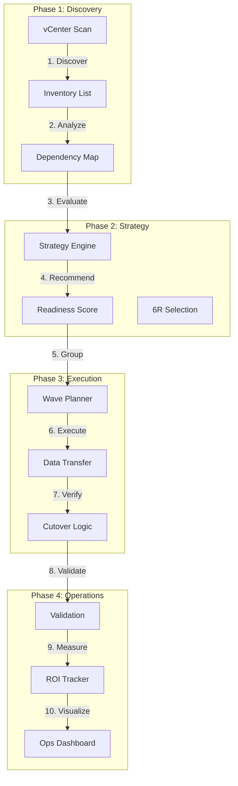

### 2. Multi-Cloud Migration Topology
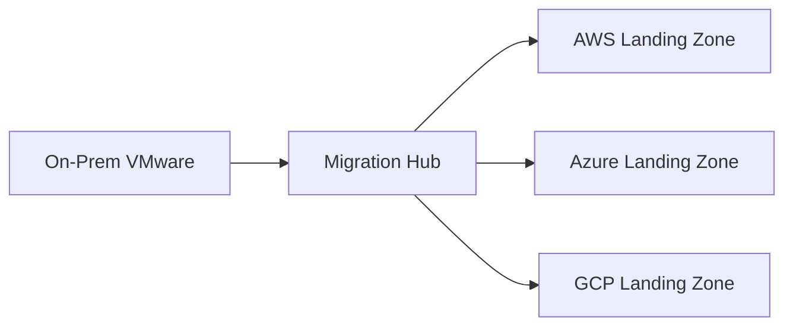

### 3. 6R Strategy Decision Flow
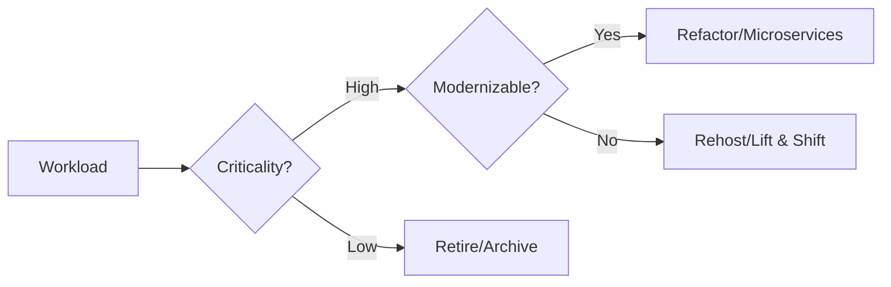

### 4. Migration Playbook Architecture
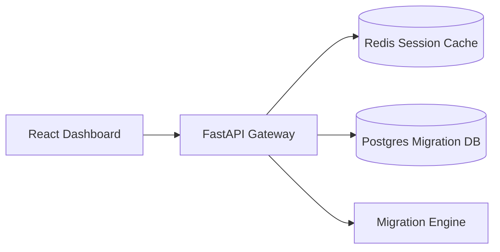

### 5. Deployment Topology: Regional Migration Factory
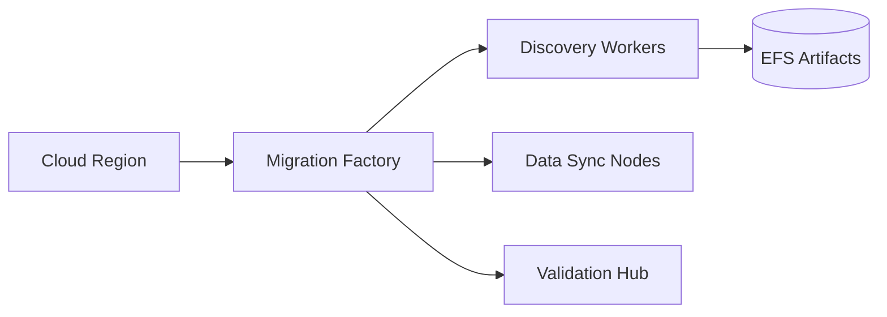

### 6. Dependency-Aware Wave Grouping
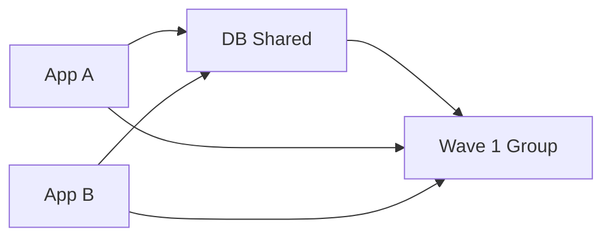

### 7. Foundation: Multi-Environment Setup
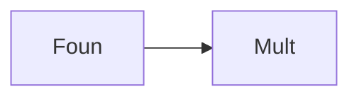

### 8. Networking: Secure Migration Tunnels
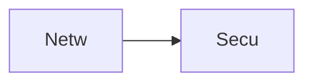

### 9. Component: Discovery Engine
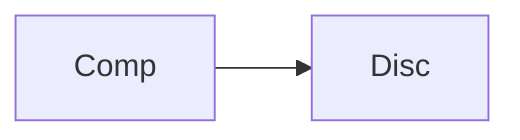

### 10. Component: Strategy Engine


### 11. Component: Execution Hub
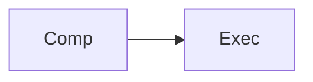

### 12. Component: ROI Modeler
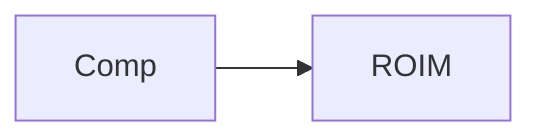

### 13. Logic: 6R Recommendation
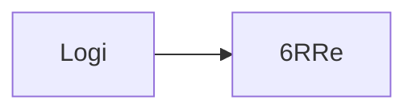

### 14. Logic: Wave Scheduling
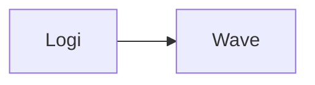

### 15. Logic: Cutover Orchestration
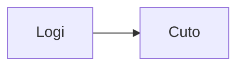

### 16. Logic: Post-Mig Validation
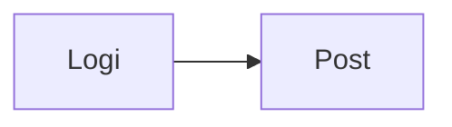

### 17. Architecture: Global Control Plane
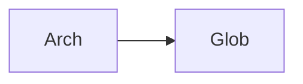

### 18. Architecture: Transformation Mesh
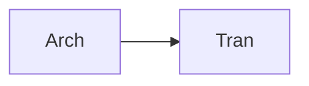

### 19. Architecture: Multi-Sink Reporting
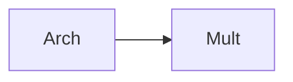

### 20. Pattern: Migration-as-Code
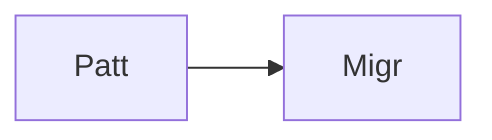

### 21. Pattern: Immutable Target Zones
```mermaid
graph LR
    P[Patt] --> I[Immu]
```

### 22. Pattern: Automated Remediation
```mermaid
graph LR
    P[Patt] --> A[Auto]
```

### 23. Security: Signed Migration Artifacts
```mermaid
graph LR
    S[Secu] --> S[Sign]
```

### 24. Security: RBAC Strategy Access
```mermaid
graph LR
    S[Secu] --> R[RBAC]
```

### 25. Security: Secure Audit Record
```mermaid
graph LR
    S[Secu] --> S[Secu]
```

### 26. Feature: Migration Heatmap UI
```mermaid
graph LR
    F[Feat] --> M[Migr]
```

### 27. Feature: Real-time Velocity Tailing
```mermaid
graph LR
    F[Feat] --> R[Real]
```

### 28. Feature: Auto-generated PCAPs
```mermaid
graph LR
    F[Feat] --> A[Auto]
```

### 29. Compliance: NIST Migration Audits
```mermaid
graph LR
    C[Comp] --> N[NIST]
```

### 30. Compliance: Audit Trail Persistence
```mermaid
graph LR
    C[Comp] --> A[Audi]
```

### 31. Infrastructure: Redis State Cache
```mermaid
graph LR
    I[Infr] --> R[Redi]
```

### 32. Infrastructure: Postgres Migration DB
```mermaid
graph LR
    I[Infr] --> P[Post]
```

### 33. Deployment: Kubernetes Migration Pods
```mermaid
graph LR
    D[Depl] --> K[Kube]
```

### 34. Deployment: Multi-Region Wave Sync
```mermaid
graph LR
    D[Depl] --> M[Mult]
```

### 35. Monitoring: velocity KPI
```mermaid
graph LR
    M[Moni] --> V[Velo]
```

### 36. Monitoring: cutover success KPI
```mermaid
graph LR
    M[Moni] --> C[Cuto]
```

### 37. UI: Unified Migration Dashboard
```mermaid
graph LR
    U[UI] --> U[Unif]
</td>
```

### 38. UI: Discovery Hub UI
```mermaid
graph LR
    U[UI] --> D[Disc]
```

### 39. UI: ROI View
```mermaid
graph LR
    U[UI] --> R[ROIV]
```

### 40. UI: Readiness Heatmap
```mermaid
graph LR
    U[UI] --> R[Read]
```

### 41. CI/CD: Wave validation pipeline
```mermaid
graph LR
    C[CICD] --> W[Wave]
```

### 42. CI/CD: Migration engine tests
```mermaid
graph LR
    C[CICD] --> M[Migr]
```

### 43. Strategy: Modernization-First Foundation
```mermaid
graph LR
    S[Stra] --> M[Mode]
```

### 44. Strategy: Data-Driven Waves
```mermaid
graph LR
    S[Stra] --> D[Data]
```

### 45. Feature: Multi-Cloud Search Bridge
```mermaid
graph LR
    F[Feat] --> M[Mult]
```

### 46. Feature: Real-time Outage Alerts
```mermaid
graph LR
    F[Feat] --> R[Real]
```

### 47. Feature: ROI Forecasting
```mermaid
graph LR
    F[Feat] --> R[ROIF]
```

### 48. Logic: Cost Comparison Engine
```mermaid
graph LR
    L[Logi] --> C[Cost]
```

### 49. Data Model: Migration Task Entity
```mermaid
graph LR
    D[Data] --> M[Migr]
```

### 50. Enterprise Transformation Excellence
```mermaid
graph LR
    E[Entr] --> T[Tran]
```

---

## 🛠️ Technical Stack & Implementation

### Platform Engine & APIs
- **Framework**: Python 3.11+ / FastAPI.
- **Migration Engine**: High-performance evaluation of VMware workloads and transformation paths.
- **Discovery Engine**: Simulated inventory and dependency mapping for VMware vCenter.
- **Strategy Engine**: Intelligent recommendation logic for 6R migration strategies.
- **ROI Engine**: Advanced financial modeling for cloud TCO and migration investment.
- **Cache**: Redis for session tracking and real-time migration status updates.
- **Persistence**: PostgreSQL for workload metadata, migration plans, and transformation logs.
- **Observability**: Prometheus/Grafana integration for migration factory monitoring.

### Frontend (Migration Command Center)
- **Framework**: React 18 / Vite.
- **Theme**: Sky / Indigo (Modern Enterprise & Cloud aesthetic).
- **Visualization**: Recharts for wave progress and strategy distribution.

### Infrastructure
- **Runtime**: AWS EKS (Kubernetes).
- **Deployment**: Helm charts for migration workers and API gateways.
- **IaC**: Terraform (Modular with Migration Infrastructure focus).

---

## 🚀 Deployment Guide

### Local Development
```bash
# Clone the repository
git clone https://github.com/devopstrio/vmware-to-cloud-playbook.git
cd vmware-to-cloud-playbook

# Setup environment
cp .env.example .env

# Launch the Migration stack (API, Engines, DB, Redis, UI)
make up

# Assess initial VMware workloads
make assess

# Generate a migration wave plan
make plan

# Validate transformation architecture
make test
```
Access the Migration Dashboard at `http://localhost:3000`.

---

## 📜 License
Distributed under the MIT License. See `LICENSE` for more information.
