<div align="center">


<h1>VMware to Cloud Playbook</h1>

<p><strong>The Institutional-Grade Platform for Standardized VMware foundations, 6R Governance, and Multi-Cloud Modernization Ecosystems.</strong></p>

[]()
[]()
[]()

<br/>

> **"Industrializing VMware modernization to automate transformation foundations."** 
> **VMware to Cloud Playbook** is an enterprise-grade platform designed to provide a secure, measurable, and highly automated foundation for global VMware transformations. It orchestrates the complex lifecycle of migrations—from automated vCenter discovery and multi-cloud 6R reconciliation to high-throughput wave intelligence and unified modernization auditing.

</div>

---

## 🏛️ Executive Summary

Legacy VMware environments and manual migration orchestration are strategic operational liabilities; lack of a standardized transformation framework is a primary barrier to organizational engineering maturity. Organizations fail to modernize their workloads not because of a lack of tools, but because of fragmented evaluation standards, lack of automated 6R reconciliation, and an inability to orchestrate migration planes with operational precision.

This platform provides the **Migration Intelligence Plane**. It implements a complete **VMware-to-Cloud-Playbook-as-Code Framework**, enabling CTOs and Migration Architects to manage global transformation foundations as first-class citizens. By automating the identification of architectural regressions through real-time telemetry analysis and orchestrating the provisioning of secure performance-driven modernization policies, we ensure that every organizational workload—from core application VMs to edge cluster instances—is assessed by default, audited for history, and strictly aligned with institutional transformation frameworks.

---

## 📐 Architecture Storytelling: Principal Reference Models

### 1. Principal Architecture: Enterprise Migration Factory & Intelligence Plane
This diagram illustrates the high-level relationship between the On-Premises VMware Environment, the Migration Intelligence Plane, and the multi-cloud target landing zones. It defines the bridge between migration engineers and the cloud transformation substrate.

```mermaid
graph LR
    %% Subgraph Definitions
    subgraph Identity["Identity & Access (Zero Trust)"]
        direction TB
        IDP[Microsoft Entra ID / AWS IAM]
        RBAC[Fine-grained RBAC Control]
        MSI[Managed Service Identities]
    end

    subgraph OnPrem["On-Premises VMware Environment"]
        direction TB
        vCenter[vCenter Server]
        Workloads[vSphere VMs / Apps]
        HCX[VMware HCX Manager]
        Discovery[Discovery Agent / Scan]
    end

    subgraph Connectivity["Secure Networking & Edge"]
        direction TB
        EXR[ExpressRoute / Direct Connect]
        HubVNet[Hub VNet / Shared Services]
        FW[Azure Firewall / AWS WAF]
        PE[Private Endpoints]
    end

    subgraph IntelligencePlane["Migration Intelligence Plane (Hub)"]
        direction TB
        API[FastAPI Migration Gateway]
        Engine[6R Strategy & ROI Engine]
        DB[(Postgres: Migration State)]
        Cache[(Redis: Real-time Sync)]
        UI[React Command Center]
    end

    subgraph TargetPlatform["Cloud Target Landing Zone"]
        direction TB
        AVS[Azure VMware Solution / VMC]
        IaaS[Native IaaS (VMs)]
        PaaS[AKS / App Service]
        DataLayer[(Azure SQL / RDS)]
    end

    subgraph DevOps["DevOps & Infrastructure as Code"]
        direction TB
        GH[GitHub Actions Pipelines]
        TF[Terraform / Bicep Modules]
        Registry[Private Module Registry]
    end

    subgraph Observability["Observability & Governance"]
        direction TB
        Monitor[Azure Monitor / CloudWatch]
        Dash[Grafana Migration Velocity]
        Policy[Azure Policy / AWS Config]
    end

    %% Flow Arrows
    Users((Enterprise Users)) -->|HTTPS/TLS| UI
    UI -->|JSON API| API
    API -->|Identity Token| IDP
    
    Discovery -->|1. Synthetic Scan| vCenter
    vCenter -->|2. Metadata Export| API
    
    API -->|3. Evaluate| Engine
    Engine -->|4. Store State| DB
    
    GH -->|5. Trigger IaC| TF
    TF -->|6. Provision| TargetPlatform
    
    HCX -->|7. Data Transfer| EXR
    EXR -->|8. Secure Tunnel| HubVNet
    HubVNet -->|9. Inspect| FW
    FW -->|10. Land| TargetPlatform
    
    TargetPlatform -->|Telemetery| Monitor
    Monitor -->|Visualize| Dash
    Policy -->|Enforce| TargetPlatform

    %% Styling
    classDef identity fill:#e1f5fe,stroke:#01579b,stroke-width:2px;
    classDef onprem fill:#f5f5f5,stroke:#616161,stroke-width:2px;
    classDef connect fill:#fff3e0,stroke:#e65100,stroke-width:2px;
    classDef intel fill:#ede7f6,stroke:#311b92,stroke-width:2px;
    classDef target fill:#e8f5e9,stroke:#1b5e20,stroke-width:2px;
    classDef devops fill:#fffde7,stroke:#f57f17,stroke-width:2px;
    classDef ops fill:#fce4ec,stroke:#880e4f,stroke-width:2px;

    class Identity identity;
    class OnPrem onprem;
    class Connectivity connect;
    class IntelligencePlane intel;
    class TargetPlatform target;
    class DevOps devops;
    class Observability ops;
```

### 2. The Transformation Lifecycle Flow (Migration-as-Code)
The continuous path of a transformation platform from initial discovery and dependency mapping to 6R strategy evaluation and validated wave execution. This ensures zero-interruption operations through dependency-aware transformation lifecycles.

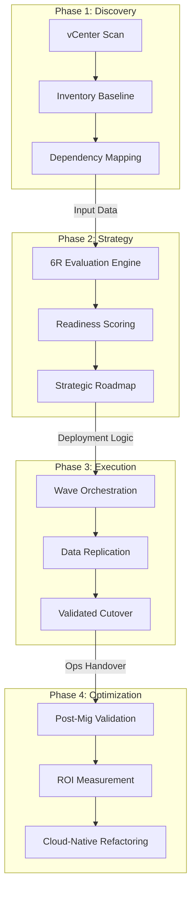

**6R Strategy Decision Framework:**
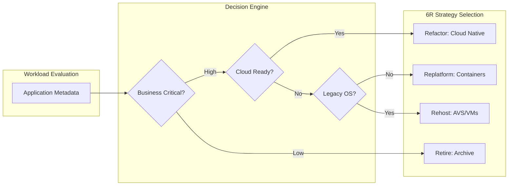

**HCX Replication Lifecycle:**
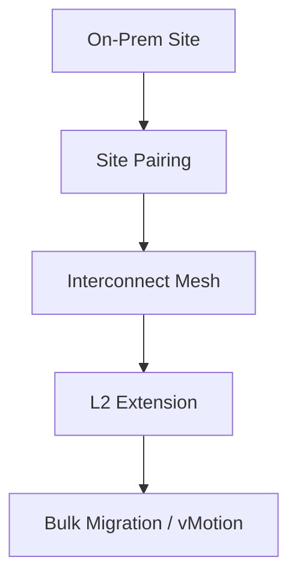

### 3. Distributed Transformation Topology (Migration Factory)
Strategically orchestrating standardized transformation across global regions and diverse resource architectures, providing a unified institutional view of migration velocity.

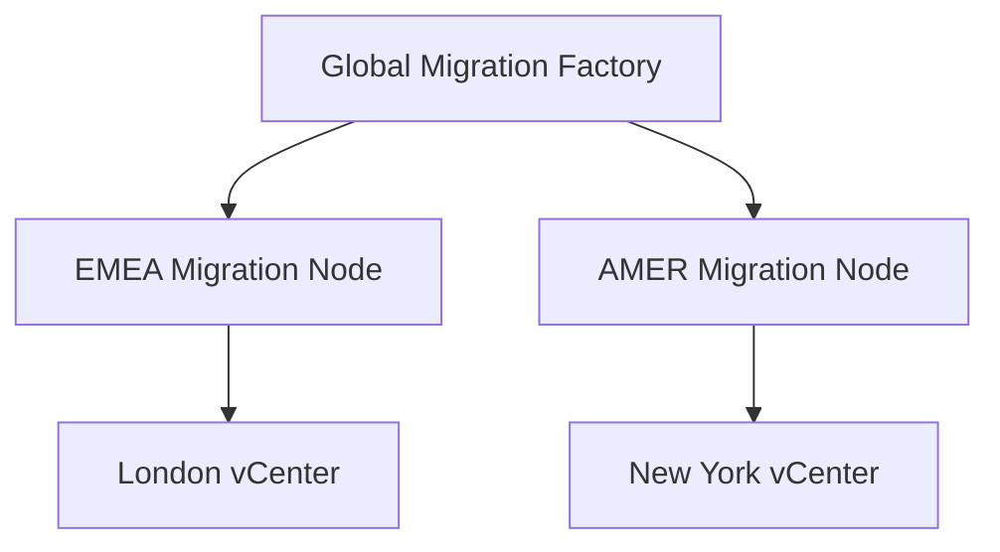

**Wave Orchestration Map:**
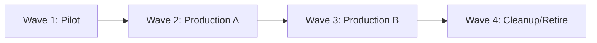

### 4. Governance Hub & Control Plane Flow (6R Strategy)
Executing complex logic for securing the bridge between on-premises workloads and cloud targets, ensuring every migration is authorized, costs are modeled, and executive oversight is maintained.

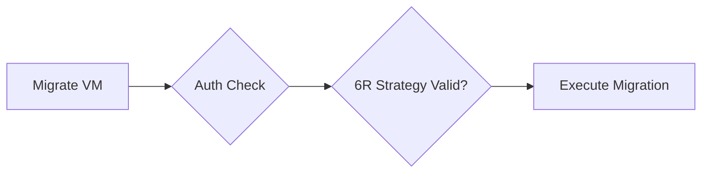

**Migration ROI Calculator:**
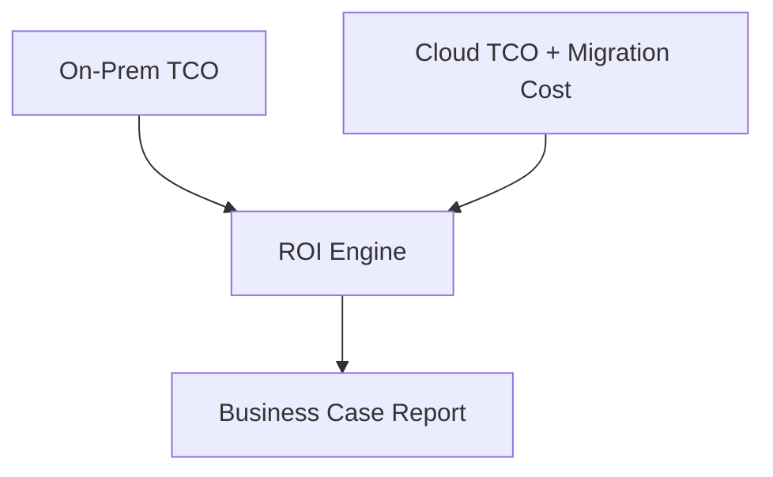

### 5. Multi-Cloud Transformation Federation (Cloud Target Landing Zones)
Automatically managing unified transformation standards across global regions and diverse cloud tenants, ensuring institutional data residency and privacy boundaries by default.

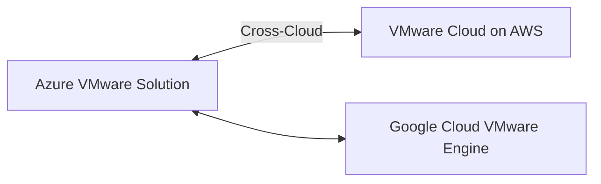

### 6. Encryption & Perimeter Protection Flow (Secure Connectivity)
Managing the lifecycle of a migration request, automatically enforcing institutional TLS 1.3 and encrypted tunnel standards (ExpressRoute, Direct Connect, Hub-VNet) as required by security policy, ensuring zero-latency transformation confidence.

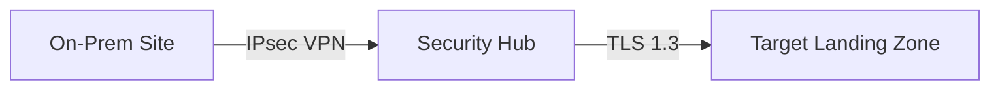

**Network Extension Security:**
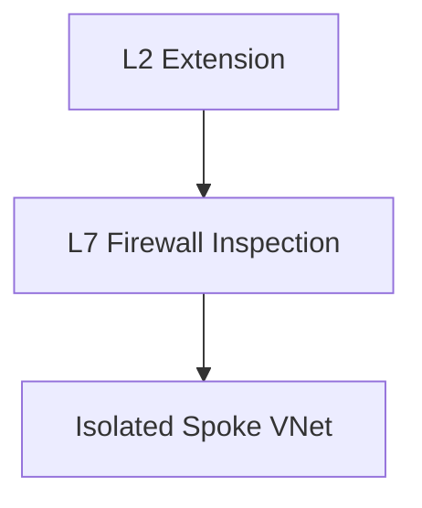

### 7. Institutional Transformation Maturity Scorecard (Migration Dashboard)
Grading organizational performance based on key indicators: Migration Velocity Index, 6R Alignment Success, and Modernization Adoption Scores.

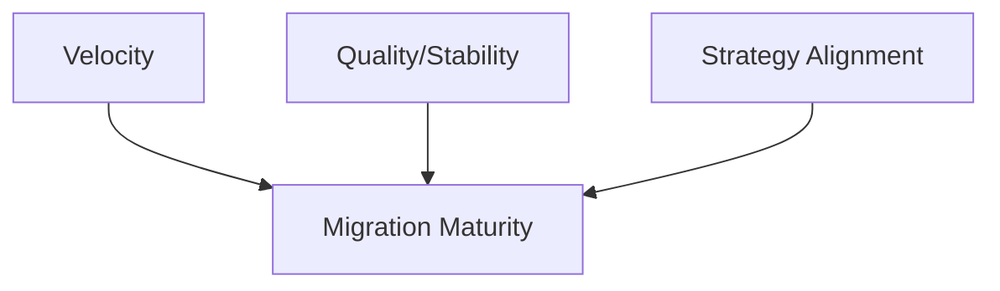

### 8. Identity & RBAC for Transformation Governance
Managing fine-grained access to migration hubs, provisioning workers, and audit logs between Migration Teams and Infrastructure principals.

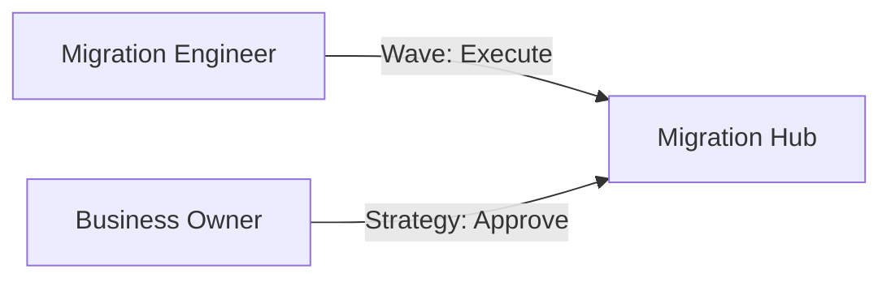

**Identity Bridge Strategy:**
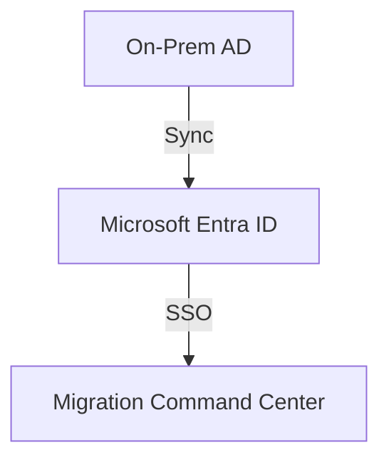

### 9. IaC Deployment: VMware-to-Cloud-Playbook-as-Code Framework
Using modular CI/CD pipelines to deploy and manage the versioned distribution of the transformation landing zones, migration workers, and validation fleets.

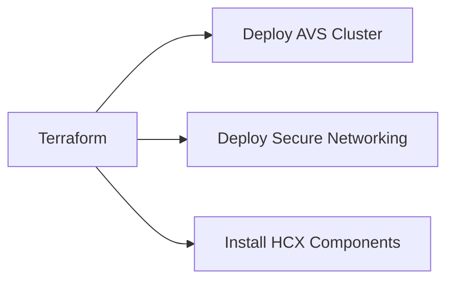

### 10. AIOps Transformation Drift & Risk Validation Flow
Using advanced analytics to identify sudden surges in replication lag, unauthorized migration changes, or unusual delivery pattern changes that could result in institutional risk or downtime.

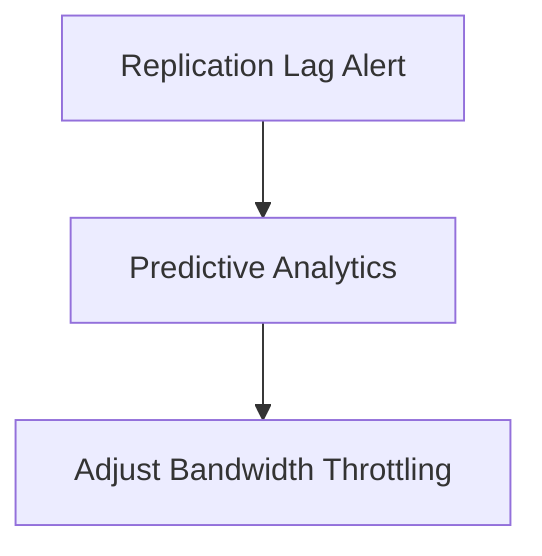

**Cutover Risk Analysis:**
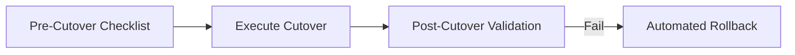

### 11. Metadata Lake for Forensic Transformation Audit
Storing long-term records of every transformation event (metadata), every migration executed, and every performance telemetry for institutional record-keeping and forensic analysis.

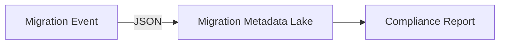

**VM Metadata Retention:**
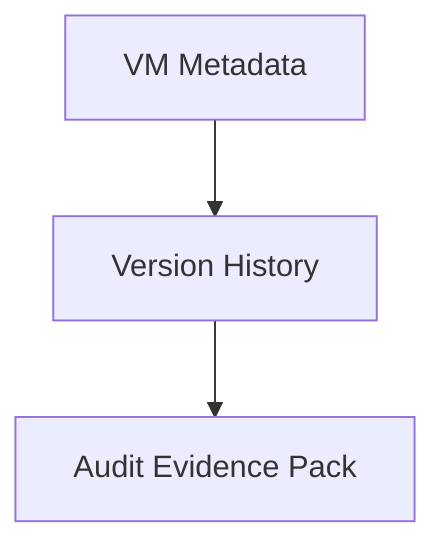

---

## 🏛️ Core Governance Pillars

1.  **Unified Foundation Coordination**: Maximizing resilience by centralizing all transformation measurement through a single institutional plane.
2.  **Automated Migration Provisioning**: Eliminating "manual tracking" scenarios through proactive orchestration and pattern verification.
3.  **Sequential Transformation Intelligence**: Ensuring zero-interruption operations through dependency-aware cutover-driven data engineering.
4.  **Zero-Trust Identity Protection**: Automatically enforcing identity-based access, encrypted tunnel security, and policy evaluation across all assurance tiers.
5.  **Autonomous Operations Logic**: Guaranteeing reliability through automated industry-specific effectiveness monitoring runbooks.
6.  **Full Transformation Auditability**: Immutable recording of every migration change and transformation provision for institutional forensics.

---

## 🛠️ Technical Stack & Implementation

### Transformation Engine & APIs
*   **Framework**: Python 3.11+ / FastAPI.
*   **Performance Engine**: Custom Python-based logic for multi-cloud migration reconciliation and DORA-style transformation metrics.
*   **Integrations**: Native connectors for VMware vCenter, HCX, Azure VMware Solution (AVS), and VMC on AWS.
*   **Persistence**: PostgreSQL (Transformation Ledger) and Redis (Live Migration State).
*   **Auth Orchestrator**: Federated OIDC/SAML for least-privilege transformation management access.

### Governance Dashboard (UI)
*   **Framework**: React 18 / Vite.
*   **Theme**: Dark, Slate, Indigo (Modern high-fidelity productivity aesthetic).
*   **Visualization**: D3.js for delivery topologies and Recharts for ROI velocity analytics.

### Infrastructure & DevOps
*   **Runtime**: AWS EKS or Azure Kubernetes Service (AKS) for management plane.
*   **Measurement Hub**: Managed event sourcing for immutable productivity timeline reconstruction.
*   **IaC**: Modular Terraform for deploying the transformation landing zone and validation fleet.

---

## 🏗️ IaC Mapping (Module Structure)

| Module | Purpose | Real Services |
| :--- | :--- | :--- |
| **`infrastructure/transformation_hub`** | Central management plane | EKS, PostgreSQL, Redis |
| **`infrastructure/enforcers`** | Distributed wave provisioners | Azure, AWS, GCP APIs |
| **`infrastructure/migration_pipes`** | Data Ingestion Hubs | Webhooks, Lambda |
| **`infrastructure/auditing`** | Forensic modernization sinks | S3, Athena, Quicksight |

---

## 🚀 Deployment Guide

### Local Principal Environment
```bash
# Clone the VMware to Cloud Playbook repository
git clone https://github.com/devopstrio/vmware-to-cloud-playbook.git
cd vmware-to-cloud-playbook

# Configure environment
cp .env.example .env

# Launch the Transformation stack
make init

# Trigger a mock transformation update and automated guardrail validation simulation
make simulate-transformation
```

Access the Migration Command Center at `http://localhost:3000`.

---

## 📜 License
Distributed under the MIT License. See `LICENSE` for more information.

---
<div align="center">
  <p>© 2026 Devopstrio. All rights reserved.</p>
</div>
